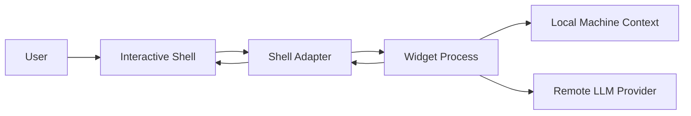
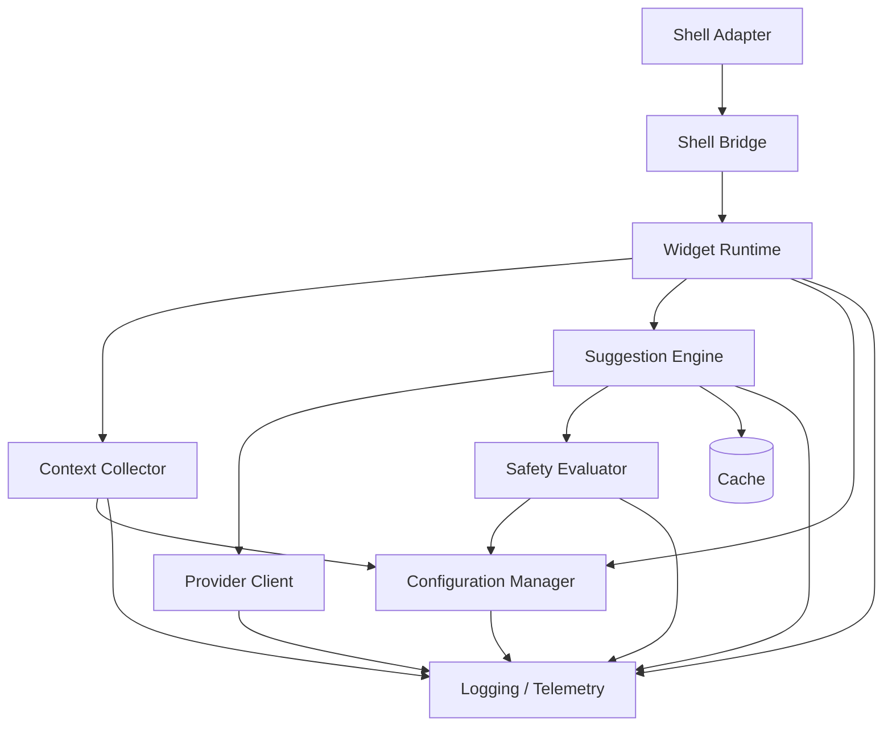
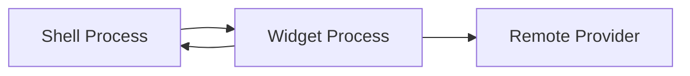
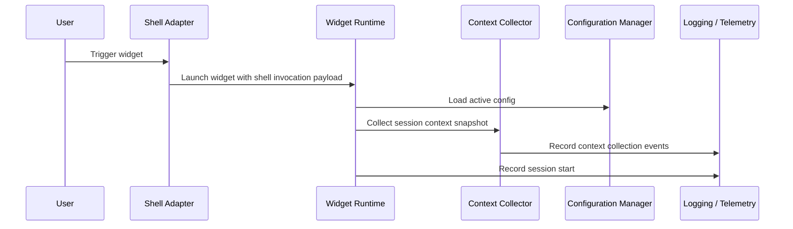
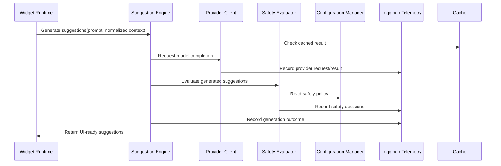
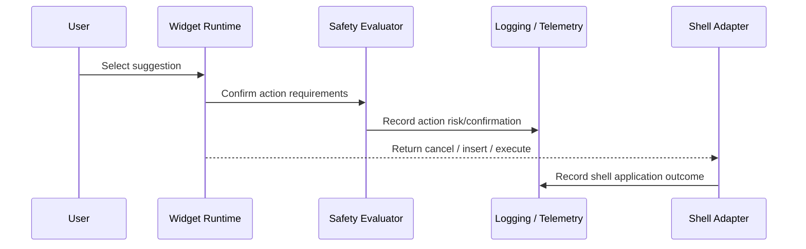

# Architecture

## Purpose and scope

This document defines the high-level architecture of `munch`.

Its purpose is to describe:

* the major runtime components
* the boundaries between those components
* the process model for MVP
* the main control flows through the system
* how failures are contained and degraded safely

This is the system decomposition document. It explains where responsibilities live and how data moves across the system, but it does not define every interface in detail.

This document defers:

* shell-specific integration behavior to `shell-integration.md`
* request and response schemas to `protocol.md`
* UI/runtime transition rules to `state-machine.md`
* safety rules and classifications to `safety-spec.md`

## Architectural goals

The architecture should satisfy the following goals:

* keep shell-specific code thin
* centralize product behavior in a shared runtime
* establish clear ownership boundaries between components
* isolate failures so shell state is never corrupted by internal errors
* abstract provider communication behind a dedicated client layer
* use a session-snapshot context model in MVP
* provide debuggability and observability from the start
* support a future move from one-shot widget processes to a long-lived local backend without invalidating the logical component model

These goals favor a narrow shell adapter, a self-contained widget runtime, and explicit component boundaries inside that runtime.

## Non-goals

This document does not attempt to define:

* exact protocol schemas
* detailed UI state transitions
* shell binding implementation details
* prompt wording
* cache key or invalidation policy
* deployment topology beyond the local process model and remote provider boundary

## System context

At a high level, `munch` sits between the user's interactive shell and a remote LLM provider. It also depends on local machine context such as history, cwd, tool availability, repo state, and configuration.

Trust boundaries:

* shell state begins inside the interactive shell process
* shell-local state is passed into the widget at invocation time
* additional local context is collected inside the widget process
* remote inference requests cross a provider boundary through the provider client

This separation is important because the shell adapter must remain trustworthy and minimal, while the widget process is allowed to own richer product behavior and more failure-prone operations such as remote API calls and parsing model output.

## Top-level component model

The MVP architecture uses the following first-class components:

* shell adapter
* shell bridge
* widget runtime
* context collector
* suggestion engine
* safety evaluator
* provider client
* configuration manager
* logging and telemetry

The cache exists as supporting infrastructure rather than as a top-level control-flow component.

### Shell adapter

The shell adapter is the shell-specific boundary layer. It captures shell-local state, launches the widget process, exchanges request and response payloads, and applies the final action back into the shell.

The shell adapter does not own product logic.

### Shell bridge

The shell bridge is the bridge-mode entrypoint inside the widget binary. It translates shell-local environment state into runtime request objects and translates final actions back into shell-safe assignments.

This keeps JSON and runtime concerns out of shell scripts while preserving a thin shell boundary.

### Widget runtime

The widget runtime owns session orchestration. It initializes the widget UI, coordinates context collection, triggers suggestion generation, requests safety evaluation, handles user selection, and returns the final action payload to the shell adapter.

The widget runtime is the central coordinator for one widget session.

### Context collector

The context collector builds the normalized local context used for suggestion generation. In MVP, it is invoked once at widget open and produces a session snapshot.

Although MVP collects once, the component is modeled as reusable so later architectures can refresh context incrementally if needed.

### Suggestion engine

The suggestion engine owns the prompt-to-suggestions pipeline. It takes prompt input and normalized context, calls the provider client, parses structured results, performs local reranking or filtering, and produces candidate suggestions for the runtime.

The suggestion engine does not own UI behavior or shell behavior.

### Safety evaluator

The safety evaluator is a distinct component that assesses generated suggestions and determines whether confirmation is required based on configured policy. In architecture terms, it sits after suggestion generation and before final action commitment.

This separation is intentional even if initial implementation colocates it with other modules.

### Provider client

The provider client is the only component that communicates with the remote inference backend. It owns request formatting for the provider boundary, transport concerns, retry behavior, and response retrieval.

The rest of the system should not depend on provider-specific APIs directly.

### Configuration manager

The configuration manager is a first-class cross-cutting component. It resolves user settings, defaults, and policy-relevant configuration such as safety level, provider settings, and feature toggles.

Configuration should flow into other components, not be reimplemented inside them.

### Logging and telemetry

Logging and telemetry are first-class components because `munch` is a user-facing product that needs out-of-band debuggability. This layer should capture operational signals, failure events, and important session milestones without becoming a control-flow owner.

Architecture remains neutral on export targets, but MVP assumes a local-first posture.

### Cache

Cache is supporting infrastructure. It may be used by the suggestion engine or related components to improve responsiveness, but it is not a primary coordinator and should not shape the main architectural boundaries in MVP.

## Process model

In MVP, the runtime is split across three execution environments:

* the interactive shell process
* the one-shot widget process
* the remote provider

The shell process hosts the shell adapter. The shell adapter launches a fresh widget process for each invocation. That widget process contains the shell bridge, shared runtime, and its first-class components. The provider client inside the widget process handles remote model calls.

This process model is intentionally simple for MVP:

* it avoids shell-side complexity
* it makes session lifetime explicit
* it simplifies cancellation and cleanup
* it gives the architecture a clean seam for later daemonization

A future long-lived backend may change the process arrangement, but it should preserve the same logical component boundaries and the same shell-facing contract.

## Core runtime flows

The architecture is easiest to understand by following the main control flows.

### Session open flow

This flow establishes the session. The shell adapter provides shell-local data. The widget runtime then resolves configuration and collects the session snapshot used throughout the rest of the widget session.

### Suggestion generation flow

This flow shows the main generation path. The runtime delegates generation to the suggestion engine. The suggestion engine may consult the cache, calls the provider client, then routes results through the safety evaluator before returning final suggestions to the runtime.

In MVP, safety evaluation is defined as post-generation and pre-action. It does not gate prompt input or prevent generation from occurring.

### Final action flow

The runtime remains responsible for orchestrating the user's final action. The shell adapter only applies the returned result; it does not reevaluate product policy.

## Responsibility boundaries

Architecture drift usually happens when adjacent components begin owning each other's concerns. This section defines the intended boundaries explicitly.

### Shell adapter

Owns:

* shell-native APIs
* invocation payload creation
* subprocess launch
* final application of `cancel`, `insert`, or `execute`

Does not own:

* suggestion generation
* safety policy
* provider calls
* shared context collection
* widget UI behavior

### Widget runtime

Owns:

* session lifecycle
* widget UI orchestration
* coordination between subcomponents
* final action creation

Does not own:

* shell-specific APIs
* provider transport
* persistent configuration storage details
* raw cache implementation details

### Context collector

Owns:

* non-shell local context gathering
* normalization of collected context into a shared representation

Does not own:

* shell-local state capture
* provider calls
* safety policy
* UI orchestration

### Suggestion engine

Owns:

* prompt-to-suggestions pipeline
* structured parsing of provider output
* local reranking and filtering
* handoff to safety evaluation

Does not own:

* shell integration
* final shell action application
* configuration persistence
* direct UI state management

### Safety evaluator

Owns:

* risk classification
* confirmation requirement decisions
* safety metadata attached to suggestions or actions

Does not own:

* provider communication
* shell execution
* prompt collection
* shell-specific confirmations

### Provider client

Owns:

* provider-specific API integration
* remote request transport
* retry and retrieval behavior

Does not own:

* shell state
* UI orchestration
* safety classification
* final suggestion ranking policy outside its returned results

### Configuration manager

Owns:

* loading and resolving configuration
* providing defaults
* exposing effective settings to other components

Does not own:

* component-specific business logic
* shell APIs
* provider transport

### Logging and telemetry

Owns:

* event capture
* structured diagnostics
* operational traces and debug signals

Does not own:

* user-facing control flow
* retry decisions
* product policy

### Cache

Owns:

* storage and retrieval of reusable results

Does not own:

* orchestration
* policy
* session lifecycle

## Shared domain models

The architecture depends on a small set of shared conceptual objects. These are not full schemas yet, but they should remain consistent across the system.

### Shell invocation

The shell invocation represents the initial request from the shell adapter into the widget runtime. It includes shell-local session inputs such as shell type, original buffer, prompt text, and cursor position.

### Widget session

A widget session is the lifetime of one invocation of the widget, from launch to final action or cancellation.

### Prompt input

Prompt input is the editable task text currently being used to generate suggestions inside the widget. It starts from the original shell buffer in MVP but is conceptually distinct from it.

### Normalized context

Normalized context is the shared local context object built by the context collector. It gives the suggestion engine a stable, shell-agnostic representation of cwd, history, tools, repo state, config-derived settings, and related local information.

### Suggestion

A suggestion is a candidate command plus its associated explanation and metadata. It is the main output of the suggestion engine before the user commits to an action.

### Safety assessment

A safety assessment captures the evaluated risk or confirmation status of a suggestion or final action according to active safety policy.

### Final action

A final action is the runtime's returned decision to the shell adapter, such as `cancel`, `insert`, or `execute`.

### Telemetry event

A telemetry event is a structured record of operational or user-flow behavior, such as session start, provider failure, parse failure, or shell application result.

## Failure boundaries and degradation behavior

The architecture must degrade safely when individual components fail.

### Shell adapter failure

If the shell adapter cannot launch the widget process or cannot obtain a valid result, the original shell buffer must remain unchanged. The adapter should prefer silent non-destructive fallback over speculative recovery.

### Context collector failure

If some local context cannot be collected, the session may continue with partial context when safe to do so. Context collection failures should be observable through logging and telemetry but should not automatically invalidate the whole session unless required inputs are missing.

### Provider client failure

Provider request failures should remain contained inside the widget process. If the widget is still active, recoverable failures should surface in the widget UI rather than leak raw transport details into the shell layer.

### Malformed provider output

Malformed provider output should be absorbed by the suggestion engine and treated as a generation failure inside the widget session. It should not propagate as undefined state into the shell adapter.

### Safety evaluator failure

If safety evaluation fails, the system should prefer conservative behavior. The exact fallback policy belongs in `safety-spec.md`, but architecturally this component must not be allowed to fail open in a way that bypasses the intended confirmation path silently.

### Logging and telemetry failure

Logging and telemetry failures must not break user-facing flows. Observability is first-class, but it remains non-blocking infrastructure.

## Cross-cutting systems

Some components influence most of the runtime without owning the main session flow.

### Configuration manager

Configuration is cross-cutting because it shapes behavior across context collection, suggestion generation, safety evaluation, provider usage, and feature enablement. It should expose resolved settings consistently rather than forcing components to interpret raw configuration independently.

### Logging and telemetry

Logging and telemetry are also cross-cutting. They provide the out-of-band visibility needed to debug failures, understand session behavior, and inspect runtime health. In MVP, architecture assumes a local-first stance, but this layer should remain flexible enough to support additional export behavior later.

### Cache

Cache is supporting infrastructure rather than a first-class architectural pillar. It improves latency and efficiency but should not be allowed to dictate the component model or session flow.

## Extension points

The architecture should leave room for future evolution without forcing a redesign of the core boundaries.

Expected extension points include:

* Bash support through an additional shell adapter
* a long-lived local backend process
* alternate transports between shell adapter and runtime
* multiple provider implementations behind the provider client boundary
* richer or incremental context refresh
* partial-buffer transforms
* alternate widget UIs

The important constraint is that these extensions should attach to existing boundaries rather than collapsing them.

## Open questions

The following questions remain open and should be finalized in later docs:

* whether long-lived sessions should refresh context incrementally in future versions
* how much telemetry remains strictly local versus becoming exportable
* whether cache should ever be promoted from supporting infrastructure to a more central architectural role
* whether any additional cross-cutting systems deserve first-class treatment as implementation proceeds
