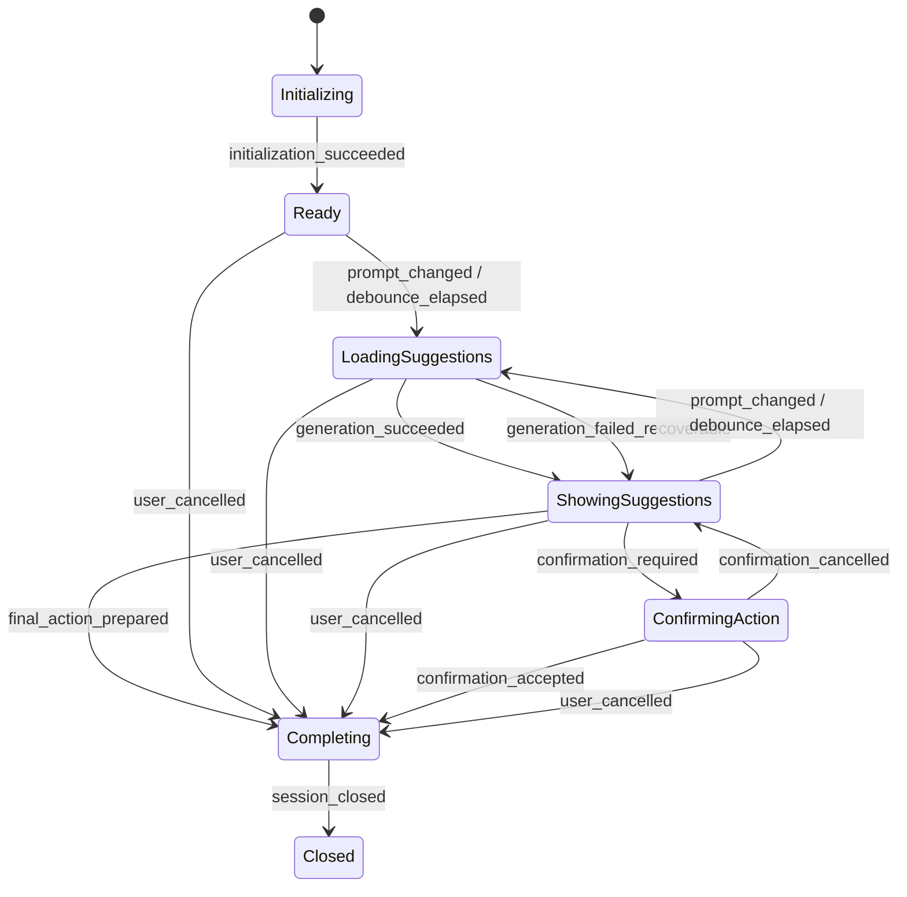
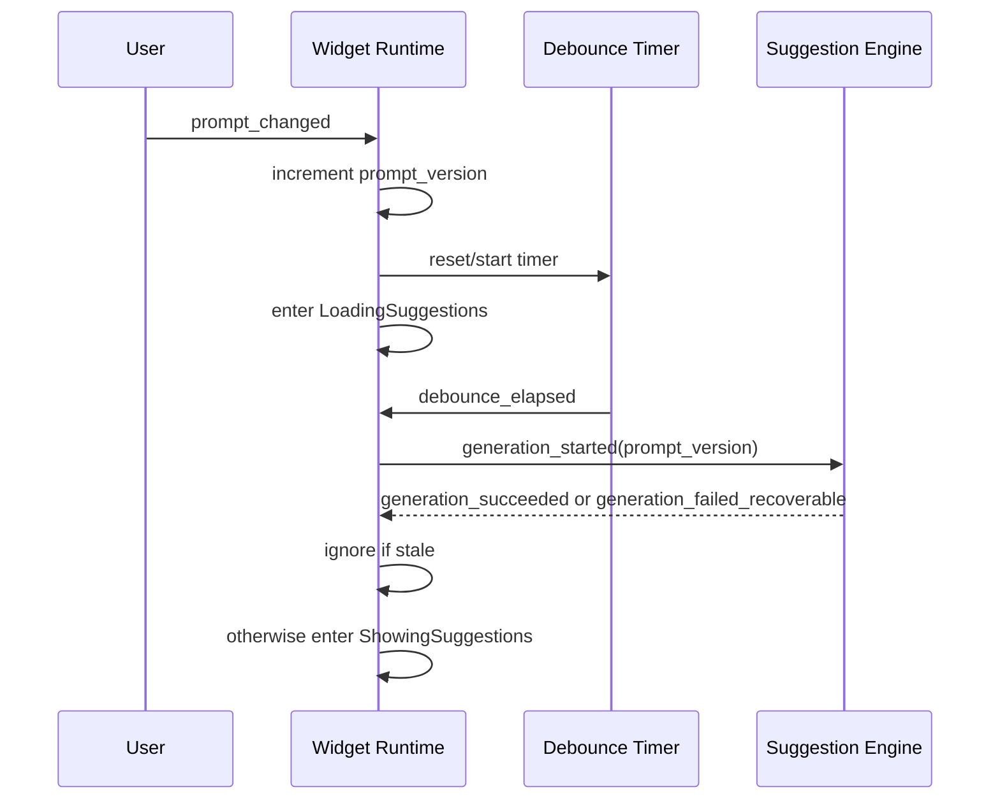
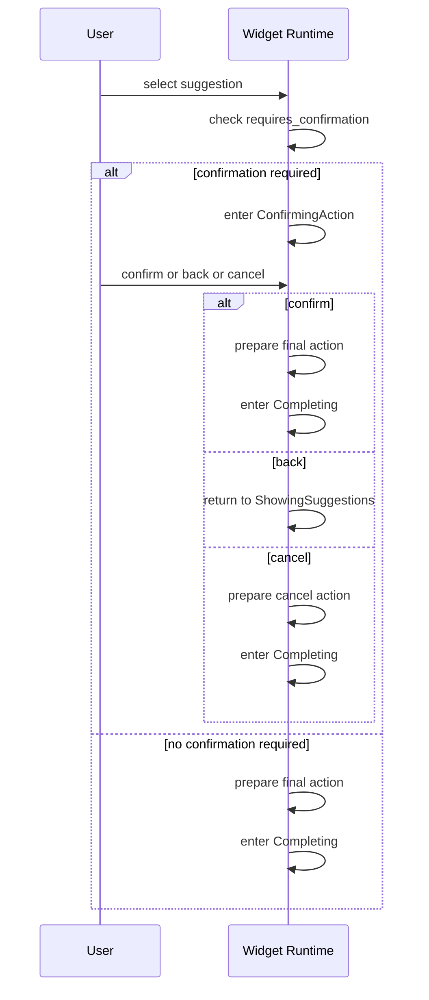

# State Machine

## Purpose and scope

This document defines the runtime state machine for one `munch` widget session.

It specifies:

* the top-level states of the widget runtime
* the events that cause transitions
* how async suggestion generation interacts with visible UI state
* how confirmation and final action handoff work
* which invariants must always hold during a session

This state machine belongs to the widget runtime. It does not define shell adapter behavior after a final action is returned, provider-specific transport details, or safety rule logic.

Those concerns belong in `shell-integration.md`, `provider-integration.md`, and `safety-spec.md`.

## State machine goals

The state machine should satisfy the following goals:

* provide predictable session behavior
* make transitions explicit
* prevent stale async results from corrupting current UI state
* preserve non-destructive behavior on cancel and failure
* use one consistent terminal handoff path for all final actions
* keep confirmation behavior explicit and modal

The runtime should be easy to reason about under normal typing, slow provider responses, empty results, and recoverable failures.

## Non-goals

This document does not attempt to define:

* widget layout or rendering details
* shell binding behavior
* provider request payloads
* retry and backoff strategy details
* safety heuristics or classification rules

## State machine boundary

One state machine instance exists per widget invocation.

The state machine begins when the widget runtime is launched and starts initializing the session. It ends when the runtime emits a final action and closes.

The shell adapter is outside this state machine. Applying the final action to the shell buffer is not modeled here.

## Top-level states

The widget runtime uses the following top-level states:

* `Initializing`
* `Ready`
* `LoadingSuggestions`
* `ShowingSuggestions`
* `ConfirmingAction`
* `Completing`
* `Closed`

These states describe the main user-visible and control-flow phases of the session.

Notably:

* recoverable errors are not a separate top-level state
* empty results are not a separate top-level state

Instead, both are represented as metadata or subconditions within active states, especially `ShowingSuggestions`.

## State metadata

Several important session conditions are better represented as metadata than as top-level states.

The runtime should track, at minimum:

* `prompt_text`
* `prompt_version`
* whether debounce is pending
* whether a generation request is in flight
* the current suggestion set, which may be empty
* any recoverable error message currently visible in the widget header
* the selected suggestion, if any
* the pending final action, if any

This distinction matters because:

* prompt changes can occur without requiring a new top-level state
* recoverable errors may coexist with visible suggestions
* empty results are still a valid post-generation outcome

## Events

The runtime reacts to the following conceptual events:

* `session_started`
* `initialization_succeeded`
* `prompt_changed`
* `debounce_elapsed`
* `generation_started`
* `generation_succeeded`
* `generation_failed_recoverable`
* `suggestion_selected`
* `confirmation_required`
* `confirmation_accepted`
* `confirmation_cancelled`
* `user_cancelled`
* `final_action_prepared`
* `session_closed`

These events may come from user input, internal timers, async completions, or internal control-flow decisions.

## State transition diagram

The diagram captures only top-level state changes. Debounce state, in-flight request tracking, errors, and suggestion contents are handled as state metadata rather than separate top-level nodes.

## Transition rules

### `Initializing -> Ready`

The runtime enters `Ready` once session setup is complete. This includes loading config, establishing the initial prompt text, and collecting the initial context snapshot.

### `Ready -> LoadingSuggestions`

When prompt input changes and generation is eligible to run, the runtime enters `LoadingSuggestions`.

The visible effect should communicate that the widget is loading suggestions immediately, while debounce timing remains internal control metadata.

### `LoadingSuggestions -> ShowingSuggestions`

When generation completes, the runtime enters `ShowingSuggestions`.

This applies to all recoverable generation outcomes:

* non-empty suggestions
* empty results
* recoverable failures that leave the widget active

In all three cases, `ShowingSuggestions` is the correct top-level state because the session has completed a generation cycle and now has a meaningful post-query result to display.

### `ShowingSuggestions -> LoadingSuggestions`

If the user edits the prompt again, the runtime re-enters `LoadingSuggestions`.

This remains true even if:

* prior suggestions are visible
* an error header is visible
* the previous result set was empty

The previous suggestions may remain visible while the next generation attempt is in progress, but the top-level state remains `LoadingSuggestions`.

### `ShowingSuggestions -> ConfirmingAction`

If the user selects a suggestion that requires confirmation, the runtime enters `ConfirmingAction`.

### `ShowingSuggestions -> Completing`

If the user selects a suggestion that does not require confirmation, or if the runtime prepares a terminal cancel action from the active session, it enters `Completing`.

### `ConfirmingAction -> ShowingSuggestions`

If the user dismisses confirmation without committing the action, the runtime returns to `ShowingSuggestions`.

### `ConfirmingAction -> Completing`

If the user accepts confirmation, the runtime prepares the final action and enters `Completing`.

### Any active state -> `Completing` on cancel

The runtime uses a single terminal handoff path for all final actions, including cancel.

This means:

* `Ready -> Completing` on cancel
* `LoadingSuggestions -> Completing` on cancel
* `ShowingSuggestions -> Completing` on cancel
* `ConfirmingAction -> Completing` on cancel

### `Completing -> Closed`

Once a final action has been prepared and emitted, the session moves to `Closed`.

`Closed` is terminal.

## Async generation model

Suggestion generation is asynchronous and must tolerate stale responses safely.

The runtime should track:

* a monotonically increasing `prompt_version`
* whether debounce is pending
* whether a request is currently in flight

Rules:

* every prompt change increments `prompt_version`
* every generation request is associated with the `prompt_version` that produced it
* late results from older prompt versions are ignored
* best-effort cancellation of old provider work is allowed but not required for correctness

The UI rule for prompt edits during loading is:

* the widget remains in a loading state immediately
* debounce timing is handled separately from visible top-level state

This avoids visible state thrash while still preserving correct request scheduling behavior.

## Suggestion visibility and error behavior

Recoverable failures are modeled as state metadata, not as a separate top-level state.

Rules:

* prior suggestions remain visible when a recoverable failure occurs
* the error is shown in the widget header or equivalent status area
* if there are no prior suggestions, the runtime still transitions to `ShowingSuggestions`
* empty results are represented by an empty suggestion set, not by a separate state

This keeps the session interactive even when one generation attempt fails or yields nothing useful.

## Confirmation and final action flow

Confirmation applies only to a selected suggestion that has already passed through safety evaluation and has `requires_confirmation = true`.

Rules:

* selecting a suggestion with `requires_confirmation = false` proceeds directly toward `Completing`
* selecting a suggestion with `requires_confirmation = true` enters `ConfirmingAction`
* `ConfirmingAction` is modal within the widget
* prompt editing is disabled during `ConfirmingAction`
* the only valid user actions in `ConfirmingAction` are confirm, back, or cancel
* confirming prepares a terminal `insert` or `execute` action
* backing out returns to `ShowingSuggestions`
* cancel from confirmation produces a terminal `cancel` action through `Completing`

This keeps confirmation semantics precise: the user is confirming one specific selected suggestion, not a moving prompt or changing result set.

## Terminal behavior

`Completing` is the only pre-terminal state.

Rules:

* every session may emit exactly one final action
* `Completing` must contain a fully prepared final action
* `Closed` is terminal
* no async generation result may modify session state after `Closed`

The final action types in MVP are:

* `cancel`
* `insert`
* `execute`

## State invariants

The following invariants must hold throughout the session:

* the original shell buffer is immutable for the lifetime of the session
* only one widget session exists per invocation
* stale generation results must never replace newer state
* visible suggestions must correspond to the most recently accepted generation outcome
* recoverable error metadata must not force the session into a terminal state by itself
* `Completing` must contain exactly one pending final action
* `Closed` must not transition to any other state

## Async flow diagram

## Confirmation flow diagram

## Open questions

The following questions remain open for later refinement:

* whether explicit retry should be modeled as its own event or remain equivalent to prompt-driven regeneration
* whether initialization failure ever needs a distinct user-visible intermediate state before the widget exits
* whether very long-lived sessions in the future should expand the state machine to model context refresh explicitly
